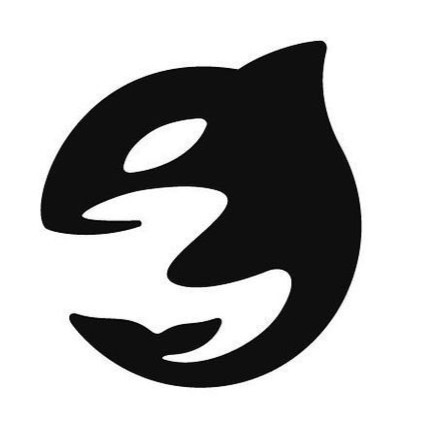
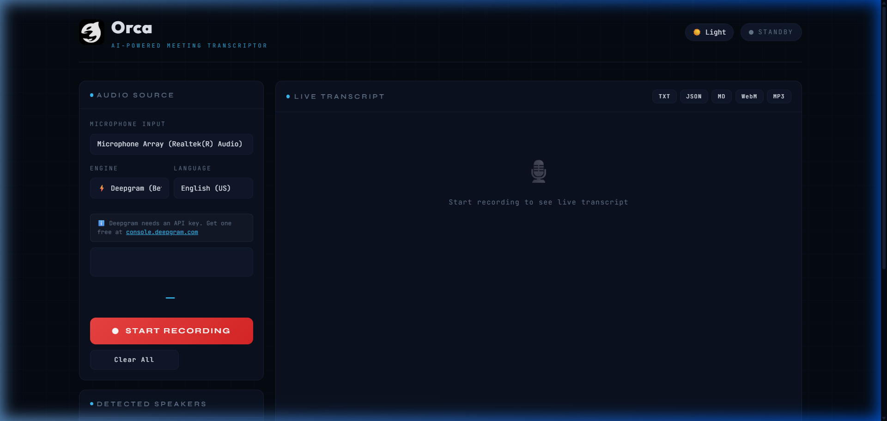
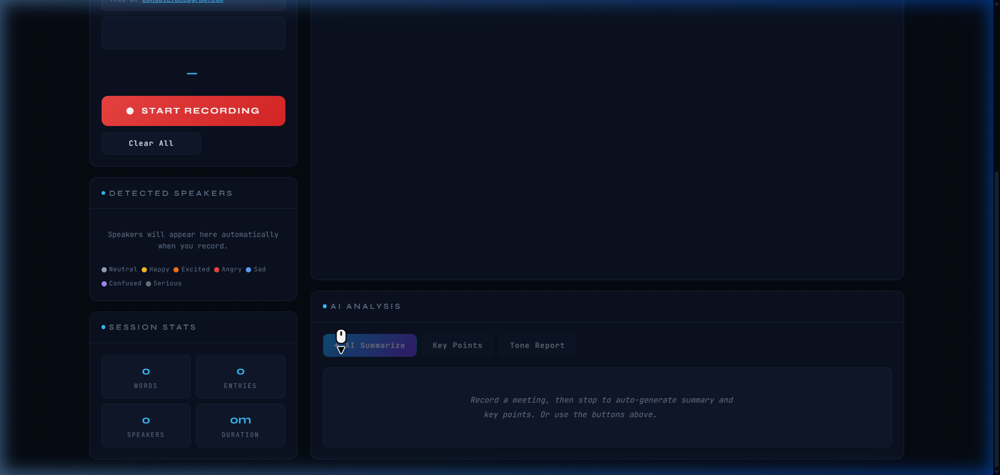
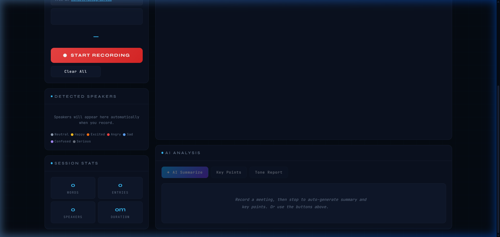

<div align="center">



# 🐋 Orca AI Meeting Transcriptor

**Real-time AI transcription · Voice-based speaker diarization · Intelligent meeting summaries**

[](https://orca-ai.vercel.app)
[](https://github.com/richardkuro/OrcaAI)
[](LICENSE)
[](https://deepgram.com)
[](https://ai.google.dev)

---

*Orca runs entirely in your browser. No backend, no uploads, no server — just open and record.*

</div>

---

## ✨ Features at a Glance

| Feature | Details |
|---|---|
| 🎤 **Live Transcription** | Real-time speech-to-text with < 100ms latency via Deepgram nova-2 |
| 👥 **Speaker Diarization** | Auto-detects and labels up to 12+ unique speakers by voice |
| 🤖 **AI Summarization** | Auto-generates meeting summaries & key action items (Gemini 2.0 Flash or local fallback) |
| 🎭 **Tone Analysis** | Tags each entry: Neutral · Happy · Excited · Angry · Sad · Confused · Serious |
| 📤 **Multi-format Export** | Download transcript as **TXT, JSON, Markdown** and audio as **WebM, MP3** |
| 🌙 **Dark/Light Theme** | Full theme toggle with persistent preference |
| 🔒 **100% Private** | All processing is client-side — audio never leaves your device |

---

## 📸 Screenshots

### Main Interface


### Audio Controls & Engine Selection


### Speaker Detection & Session Stats


### AI Analysis Panel


---

## 🚀 Quick Start

### Option 1 — Use the Live Demo
> Click the **[Live Demo](https://orca-ai.vercel.app)** badge above — no install required.

### Option 2 — Run Locally

```bash
# Clone the repo
git clone https://github.com/richardkuro/OrcaAI.git
cd OrcaAI

# Serve locally (any static server works)
python -m http.server 8080
# → open http://localhost:8080
```

### Option 3 — Deploy to Vercel (1 click)

[](https://vercel.com/new/clone?repository-url=https://github.com/richardkuro/OrcaAI)

---

## 🔑 API Keys

Orca works with **two optional API keys** for enhanced features:

| Key | Where to get it | What it unlocks |
|---|---|---|
| **Deepgram** | [console.deepgram.com](https://console.deepgram.com) | Voice diarization, multi-speaker detection, 99%+ accuracy |
| **Gemini** | [aistudio.google.com](https://aistudio.google.com/apikey) | AI summaries, key points, tone analysis via Gemini 2.0 Flash |

> **Without keys:** Orca falls back to the browser's built-in Web Speech API for transcription and local keyword extraction for AI analysis — fully functional, no API required.

---

## 🏗️ Architecture

```
OrcaAI/
├── index.html          ← App shell & UI structure
├── css/
│   └── styles.css      ← Complete design system (dark/light themes)
├── js/
│   ├── app.js          ← Orchestrator — state, events, wiring
│   ├── recorder.js     ← Audio capture, engine routing, speaker detection
│   ├── deepgram.js     ← Deepgram WebSocket integration
│   ├── ai.js           ← AI analysis (Gemini + local fallback, rate limited)
│   ├── ui.js           ← UI rendering & theme management
│   ├── transcript.js   ← Transcript display & management
│   └── export.js       ← TXT/JSON/MD/WebM/MP3 export
├── img/
│   ├── orca-logo.png
│   └── orca-logo.svg
└── slides/             ← Presentation slides (pitch, AMD, roadmap)
```

### How It Works

```
Microphone Input
        ↓
  [recorder.js] ──── chunks audio ────→ [Deepgram WebSocket]
        │                                        ↓
        │                             Speaker-diarized transcript
        ↓                                        ↓
 [Web Speech API]               [transcript.js] renders entries
  (fallback)                             ↓
                                [ai.js] — on stop → Gemini API
                                         ↓
                              Summary · Key Points · Tone Report
                                         ↓
                                 [export.js] → file downloads
```

---

## 🔧 Configuration

All config lives in `js/app.js`. For demo purposes, API keys can be hardcoded:

```js
const DEMO_DEEPGRAM_KEY = 'your_deepgram_key_here';
const DEMO_GEMINI_KEY   = 'your_gemini_key_here';
```

> **Rate limiting** is built into `js/ai.js` — Gemini calls are spaced ≥ 5s apart with exponential backoff on 429 errors, keeping usage safely under the free tier limit of 15 RPM.

---

## 🛣️ Roadmap

### Phase 1 — Now (Client-side)
- [x] Real-time transcription (Deepgram + Web Speech API)
- [x] Voice-based speaker diarization
- [x] AI summarization & tone analysis
- [x] Multi-format export (TXT, JSON, MD, WebM, MP3)
- [ ] 🔍 Real-time transcript search
- [ ] 📄 PDF export
- [ ] 🌐 Offline transcription (transformers.js + Whisper WASM)

### Phase 2 — Next (Backend)
- [ ] 🔑 Auth + meeting history (Firebase)
- [ ] 👥 Team workspaces
- [ ] 📊 Analytics dashboard (talk-time, tone trends)

### Phase 3 — Future (Self-hosted AI)
- [ ] 🔴 Self-hosted Whisper on AMD Instinct MI300X + ROCm
- [ ] 🧠 Self-hosted LLM via vLLM + Llama 3 (drop Gemini dependency)
- [ ] 💳 SaaS billing

---

## ⚡ AMD Integration Plan

Orca is designed to scale to a fully self-hosted, AMD-powered AI stack:

| AMD Product | Role | Benefit |
|---|---|---|
| **Instinct MI300X** | Run Whisper + Llama 3 locally | < 200ms latency, zero API cost |
| **ROCm 6.0** | Open-source ML runtime (CUDA alternative) | PyTorch / vLLM compatible |
| **EPYC Server CPU** | API backend + WebSocket gateway | 500+ concurrent audio streams |

```bash
# Self-hosted Whisper on ROCm
pip install torch --index-url https://download.pytorch.org/whl/rocm6.0
pip install openai-whisper pyannote.audio

# Self-hosted LLM via vLLM
pip install vllm  # AMD ROCm build
vllm serve meta-llama/Llama-3-70B-Instruct --port 8000
```

Then simply swap the endpoints in `deepgram.js` and `ai.js` — the API shape is identical.

---

## 🛠️ Tech Stack

- **Frontend:** Vanilla HTML5 · CSS3 · ES6 Modules (zero dependencies, zero build step)
- **Transcription:** Deepgram nova-2 (WebSocket) · Web Speech API (fallback)
- **AI:** Gemini 2.0 Flash API · Local keyword extraction (fallback)
- **Audio:** Web Audio API · MediaRecorder API · lamejs (MP3 encoding)
- **Hosting:** Vercel (static)

---

## 📝 License

MIT — free to use, modify, and deploy.

---

<div align="center">

Built with 🐋 by **Richard Konsam**

[⭐ Star this repo](https://github.com/richardkuro/OrcaAI) · [🐛 Report a bug](https://github.com/richardkuro/OrcaAI/issues) · [💡 Request a feature](https://github.com/richardkuro/OrcaAI/issues)

</div>
